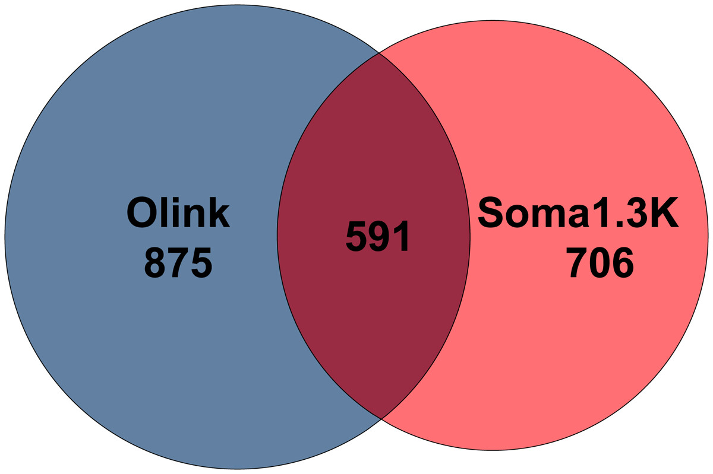
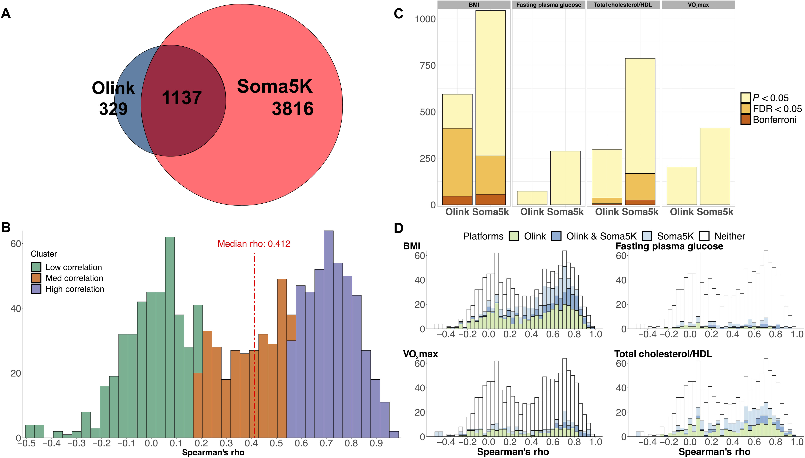
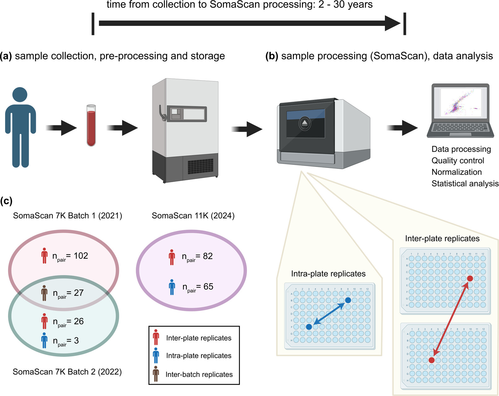
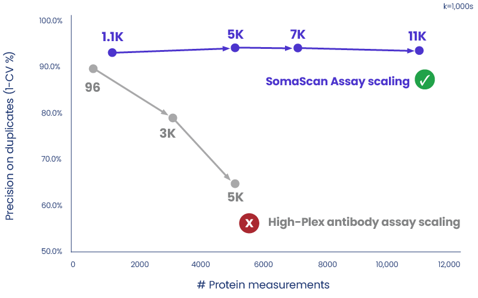

1.  [Katz D H, Robbins J M, Deng S, et al. Proteomic profiling platforms head to head: leveraging genetics and clinical traits to compare aptamer-and antibody-based methods[J]. Science Advances, 2022, 8(33): eabm5164.](https://www.science.org/doi/full/10.1126/sciadv.abm5164)

2.  [Eldjarn G H, Ferkingstad E, Lund S H, et al. Large-scale plasma proteomics comparisons through genetics and disease associations[J]. Nature, 2023, 622(7982): 348-358.](https://www.nature.com/articles/s41586-023-06563-x)

3.  [Candia J, Fantoni G, Delgado-Peraza F, et al. Variability of 7K and 11K SomaScan plasma proteomics assays[J]. Journal of Proteome Research, 2024, 23(12): 5531-5539.](https://pubs.acs.org/doi/full/10.1021/acs.jproteome.4c00667)

4.  [Rooney M R, Chen J, Ballantyne C M, et al. Plasma proteomic comparisons change as coverage expands for SomaLogic and Olink[J]. medRxiv, 2024.](https://pmc.ncbi.nlm.nih.gov/articles/PMC11261933/)

