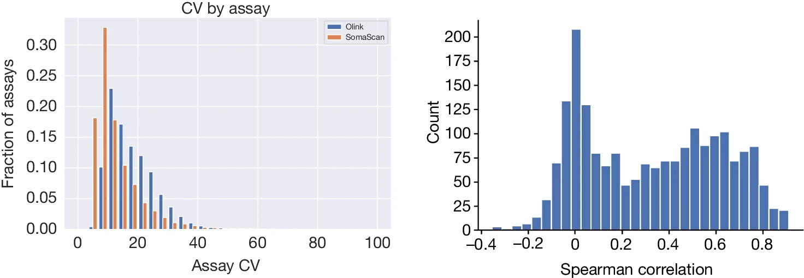
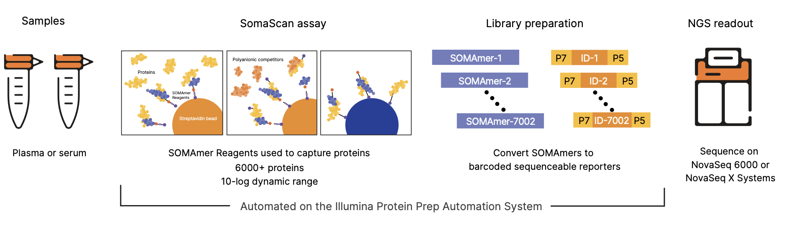
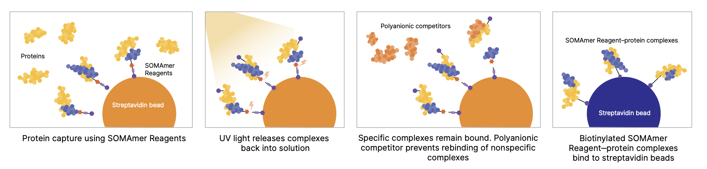
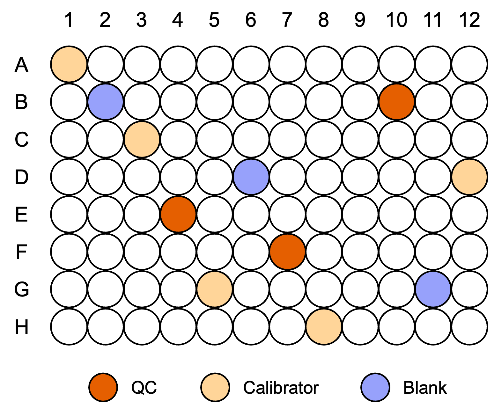
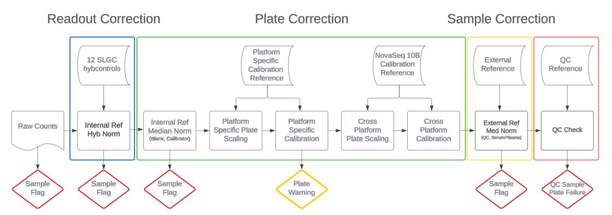

1.  [Katz D H, Robbins J M, Deng S, et al. Proteomic profiling platforms head to head: leveraging genetics and clinical traits to compare aptamer-and antibody-based methods[J]. Science Advances, 2022, 8(33): eabm5164.](https://www.science.org/doi/full/10.1126/sciadv.abm5164)

    评估了 SomaScan 1.3K（1301 种试剂）、SomaScan 5K（4979 种试剂）和 Olink Explore（1472 种试剂）三种分析技术在 Jackson Heart Study的568名成年人和 HERITAGE Family Study 的 219 名参与者中的表现，
    考察了四个性能领域：精确性、准确性、分析广度以及利用详细临床表型和遗传数据的表型关联。
    研究结果显示，Olink 平台在蛋白靶标特异性和表型关联的数量上表现更为可靠，而 SomaScan 平台在蛋白质组范围内的测量精确性和分析广度方面具有更大的优势。

    

    

2.  [Eldjarn G H, Ferkingstad E, Lund S H, et al. Large-scale plasma proteomics comparisons through genetics and disease associations[J]. Nature, 2023, 622(7982): 348-358.](https://www.nature.com/articles/s41586-023-06563-x)

    本研究中，对UK Biobank Pharma Proteomics Project 生成的 Olink Explore 3072 数据进行了关联研究，分析了超过 50,000 名 UK Biobank 参与者（包括英国或爱尔兰、非洲和南亚血统）的血浆样本，同时结合了他们的表型和基因型数据。
    我们将这些结果与对 36,000 名冰岛人血浆样本进行的 SomaScan v4 研究进行了比较，其中有 1,514 人同时具备 Olink 数据。结果显示，两个平台之间的相关性较为温和。
    尽管两个平台检测到的顺式蛋白定量性状位点（cis-pQTLs）的绝对数量相近（Olink 平台为 2,101，SomaScan 平台为 2,120），但在具有 pQTL支持证据的检测比例上，Olink平台更高（72% 对比 43%）。

    

3.  [Candia J, Fantoni G, Delgado-Peraza F, et al. Variability of 7K and 11K SomaScan plasma proteomics assays[J]. Journal of Proteome Research, 2024, 23(12): 5531-5539.](https://pubs.acs.org/doi/full/10.1021/acs.jproteome.4c00667)

    

4.  [Rooney M R, Chen J, Ballantyne C M, et al. Plasma proteomic comparisons change as coverage expands for SomaLogic and Olink[J]. medRxiv, 2024.](https://pmc.ncbi.nlm.nih.gov/articles/PMC11261933/)

    

5.  Olink最新产品：Olink® Explore HT：[olink-explore-ht-assay-list](./olink-explore-ht-assay-list.xlsx)

6.  Overview of the Illumina Protein Prep solution：Samples are pooled and sequenced on the **NovaSeq 6000** or **NovaSeq X System**

    

7.  Protein-capture using the SOMAScan assay(> 9K unique human protein targets, corresponding to 11K SOMAmers, will be available in **early 2025**.)

    SOMAmer试剂（蓝色）包含光可裂解连接子和生物素。SOMAmer试剂结合到链霉亲和素珠子上，用于从血清或血浆中复杂的蛋白混合物中捕获特定蛋白（黄色）。
    未结合的蛋白被洗去，结合的蛋白被标记上生物素。接下来，使用紫外光破坏光可裂解连接子，将SOMAmer–蛋白复合物释放回溶液中。
   在孵育步骤中，非特异性复合物解离，而特异性复合物保持结合。孵育步骤中加入多阴离子竞争物，防止解离的蛋白非特异性重新结合。
    特异性的蛋白-SOMAmer试剂复合物随后被捕获到新的链霉亲和素珠子上，并通过NGS（下一代测序）进行洗脱和相对定量分析。

    

# 知识点

1. 测序深度: 40M/reads per sample 测序模式：15，index=10，index=10，0 目前只支持在NovaSeqX 分lane测序

2. [在线user guide:https://help.connected.illumina.com/multiomics-software/dragen-protein-quantification/](https://help.connected.illumina.com/multiomics-software/dragen-protein-quantification/)

3. [关于湿实验FAQ:https://knowledge.illumina.com/library-preparation/multiomics-library-prep/library-preparation-multiomics-library-prep-faq-list](./https://knowledge.illumina.com/library-preparation/multiomics-library-prep/library-preparation-multiomics-library-prep-faq-list)

4.  测序样本布局 Each plate:85 samples+11 controls

<pre>
2 plates:

    NovaSeq 6000 with S4 flow cell (35c):170 samples +22 controls
    NovaSeq X 10B with flow cell(100c):170 samples +22 controls

4 plates:

    NovaSeq X with 25B flow cell(100c):340 samples + 44 controls
</pre>

**5-Calibrator controls（完全重复的5个样本）**

样本来源：A pool of matrix-matched (EDTA Plasma, Serum, Cerebral Spinal Fluid [CSF], Urine) adult, normal donor samples

**3-QC samples（完全重复的3个样本）**

样本来源：A pool of matrix-matched (EDTA Plasma, Serum, Urine, CSF) adult, normal donor samples (different from the Calibrator control)

**3-Blank samples**

样本来源：空白对照样本由纯缓冲液组成

**SOMAmer试剂对照（12 SomaLogic Hybcontrols）**

SOMAmer试剂对照以已知浓度加入每个样本中，在杂交前用于计算样本特异性比例因子，以归一化样本并评估质量

5.  样本类型:1个板子必须是同类型的样本要么全是serum samples or all plasma samples (cannot mix and match)不能混合
<pre>
血清（Serum、Serum_Calibrator、Serum_QC、Blank）
血浆（Plasma_QC、Plasma_Calibrator、Plasma、Blank）
</pre>

6.  实验过程

三个稀释梯度包含不同的SOMAmers，但每个样本都会经过三种稀释
<pre>
1:20k 稀释度：用于捕获高丰度的蛋白质
1:200 稀释度：用于捕获中等丰度的蛋白质
1:5 稀释度：用于捕获低丰度的蛋白质
</pre>

7.  数据分析

8.   Coefficient of Variation (CV) 计算方法

Coefficient of Variation (CV = SD(Count)/mean(Count)) 

9.  本地dragen软件版本

FCR probe pool (AB) ：DRAGEN Protein quantification v2.2 or higher
EALR probe pool (AA)：DRAGEN Protein quantification v2.1

